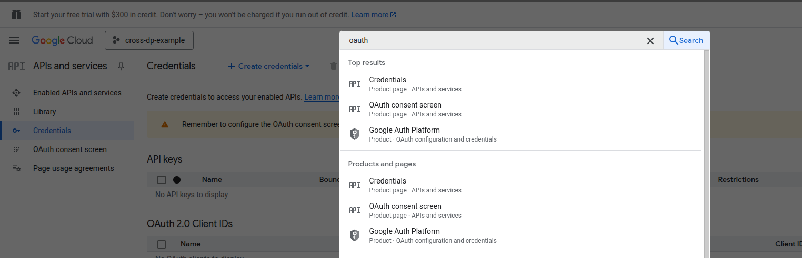
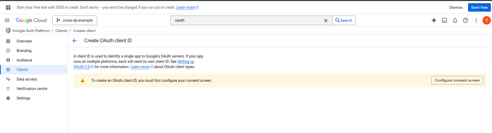
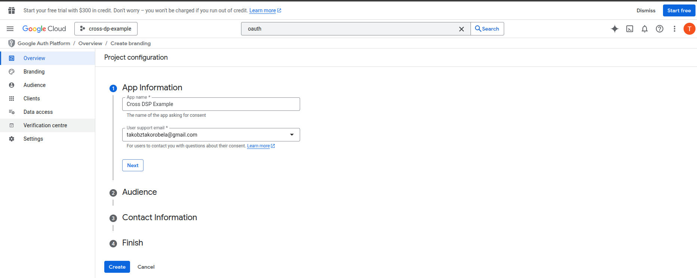
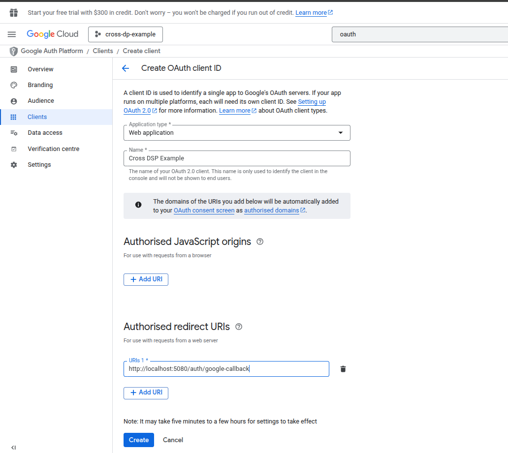
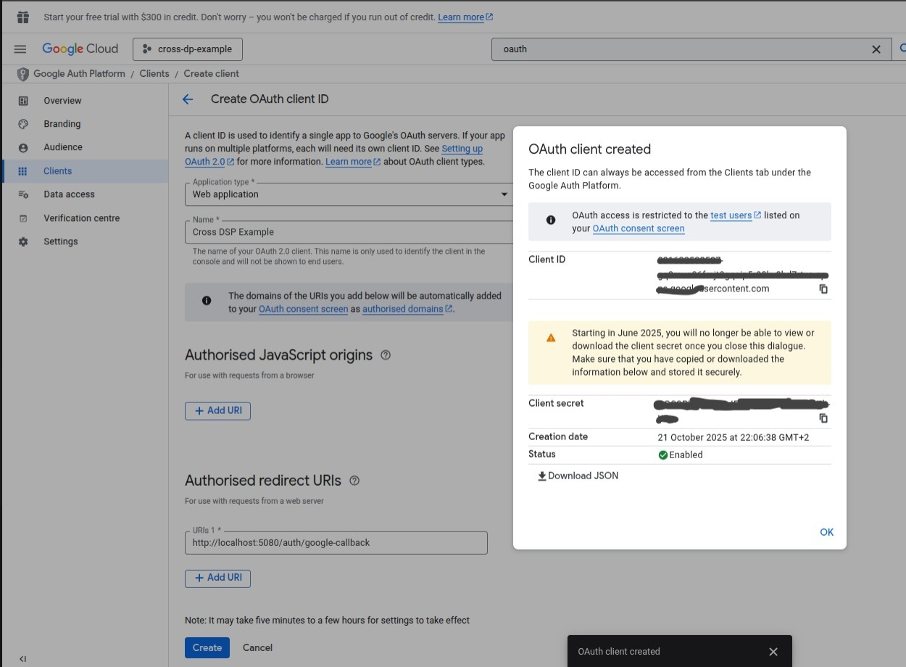
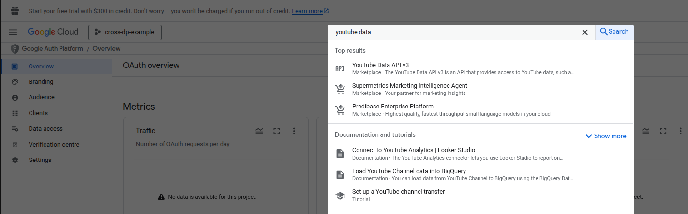
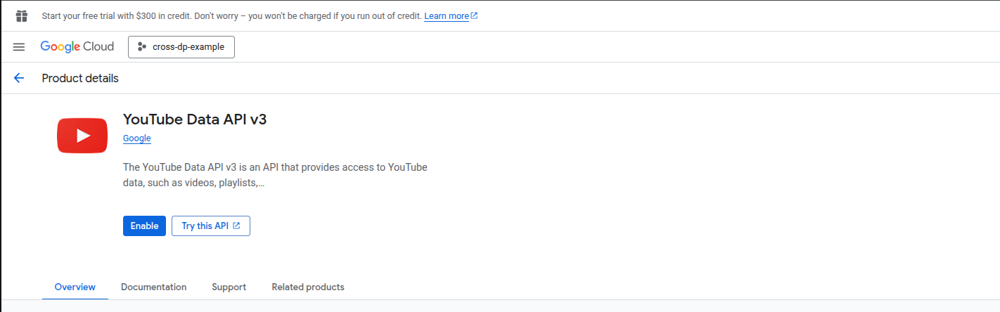
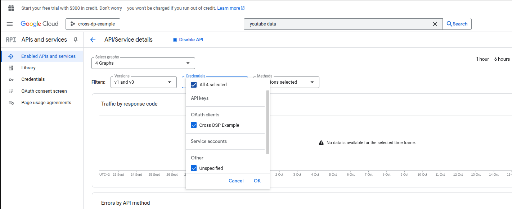

# GOOGLE OAuth Guide.
In this guide we will look at how to create an OAuth App that will allow us to authenticate against google.

## Creating OAuth App In Google Console App
The first thing we need to do is create an oauth app in the google console app. Please follow the steps listed below:

- Login to the [google console](https://console.cloud.google.com/) using your google account.

- After login select a project you'd love to work in, if you have none you create one or use the already created `No Organisation`:

- After the project is created you'll be navigated to your project, on the search bar search for `oauth`, one of the results show be `Credentials`, click on it:  

- If you haven't configured the consent screen, you will see a warning, click on the `Configure Consent Screen`:  

- On the consent screen just fill in basic information like the application name. Just make sure the Audience is `External` because we want to authenticate anyone who has a google account with this app:

- After the consent is created, go to the `client` menu option and create client, as seen below:  

- When creating a client app make sure the values are as follows below, you can always change the name to whatever you want just make sure the application type is `web application`, also the redirect can change as the app evolves so just make sure it is consistent with what is in the `appsettings.json` of the backend code:  

- When you click create, you will be presented with a `Client ID` and `Client Secret`. You can download as JSON or copy, just keep them safe, you can only view the secret once, so don't lose it, you will need them in your `appsettings.Development.json`:  

Now that the app is created, and since it is a testing application, not yet published for public use we'd need to manually add users who can authenticate against it, most likey yourself. See the next [section](#add-yourself-as-test-user).

## Add Yourself As Test User

- Go to the `Auidence` menu and you should see a `Test Users` option add a user, this will be a user you will be singing in with to test, it can be your own gmail account, like shown below:

- After the user is added you should see them listed on the below the Test User option. That's it you are done.

After creating the app and adding a test user we need to tell Google to allow the app to be used to query the YouTube Data API, since that's the API we will be using to get YouTube Music data.

## Enabling App To Use YouTube APIs

- On the search in console, search for `YouTube Data API`, click on the YouTube Data API V3 (it was V3 at the time of writing):  

- You should see an `Enable` button, click on it:

- After you've enabled you should see the app you created on the `Credentials` drop-down, as seen below:

